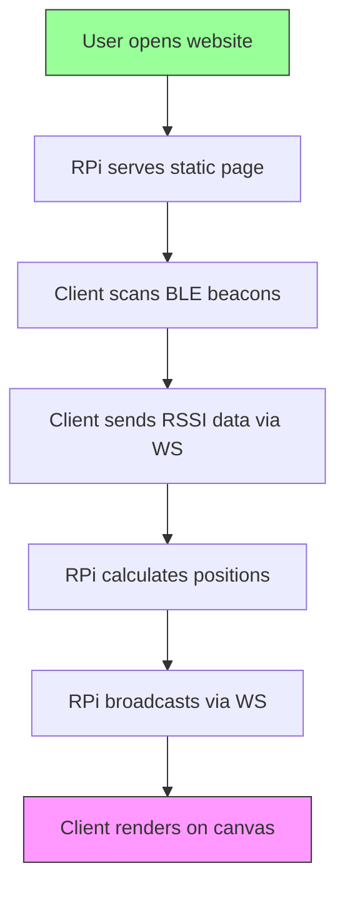

# Bluetooth Map
A website that visualizes foot traffic nearby by allowing people to connect to a Bluetooth device and then visualizing their relative positions on a map.

## Tech Stack
### Frontend (Client):
- Web Bluetooth API
- WebSocket

### Backend (Raspberry Pi):
- Python with:
	- Flask (web server)
	- Flask-SocketIO (WebSocket support)

### Beacons
- Android phones running [Beacon Simulator](https://apkpure.com/beacon-simulator/net.alea.beaconsimulator#google_vignette)


## Project Flow


## Directory Structure
```
/ble-tracker/
├── server/                 # Raspberry Pi backend
│   ├── app.py              # Main Flask + WebSocket server
│   ├── trilateration.py    # Position calculation logic
│   └── requirements.txt    # Python dependencies
│
├── client/                 # All frontend files
│   ├── index.html          # Single HTML file
│   ├── style.css           # Minimal styling
│   └── app.js              # BLE + WebSocket logic
│
├── config/
│   └── beacons.json        # Beacon IDs and fixed positions
│
└── README.md               # Setup instructions
```
