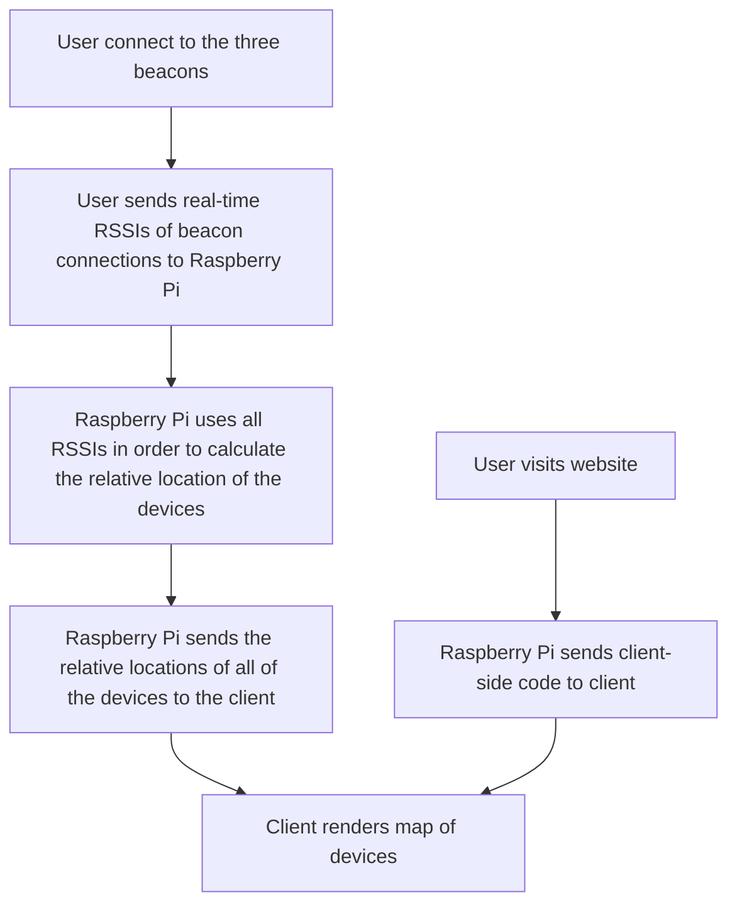

# Bluetooth Map
A website that visualizes foot traffic nearby by allowing people to connect to a Bluetooth device and then visualizing their relative positions on a map.

## Tech Stack
### Frontend
  - **Mapping**: Leaflet.js
  - **Visualization**: Canvas API

### Backend
  - **Database**: SQLite
  - **Server**: Node.js with Express.js

### Bluetooth Beacons
  - **Phones**: [Bluetooth Simulator](https://apkpure.com/beacon-simulator/net.alea.beaconsimulator)
  - **Server(Raspberry Pi)**: Node.js + Express.js

## Project Flow

